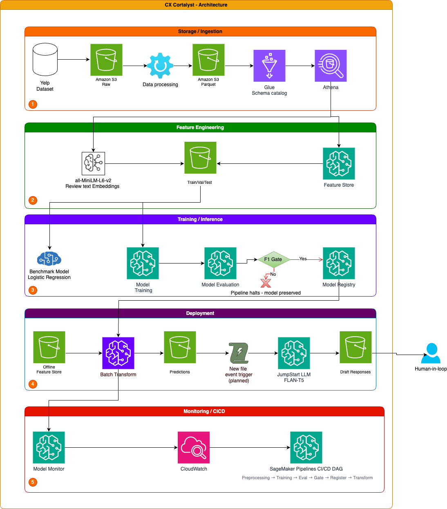

# CX Cortalyst — Customer Sentiment Analysis & GenAI Response Automation

**AAI-540 Machine Learning Operations**
**Author:** Jagadeesh Kumar Sellappan
**Course:** AAI-540, University of San Diego

---

## Project Overview

CX Cortalyst is an end-to-end MLOps system that automates customer sentiment triage for businesses receiving high-volume online reviews. The system classifies incoming reviews as **Positive** or **Negative** using a trained XGBoost model, then automatically drafts a personalized, empathetic email response for every negative review using a generative AI model — ready for a human agent to review and send.

The project covers the full machine learning lifecycle on AWS SageMaker: data ingestion, feature engineering, model training and registry, automated batch deployment, infrastructure and model monitoring, a CI/CD pipeline with an automated quality gate, and a downstream GenAI response module.

## Business Problem

Businesses on review platforms like Yelp receive large volumes of customer feedback daily. Manually triaging negative reviews and drafting thoughtful responses takes significant staff time, and delayed responses increase customer churn risk. CX Cortalyst solves this by automatically flagging negative reviews in batch and generating a draft response for immediate human review — reducing response time from hours to minutes.

## Dataset

[Yelp Open Dataset](https://www.kaggle.com/datasets/yelp-dataset/yelp-dataset) — 5 files, ingested and cataloged via AWS Glue/Athena:

| File | Records | Role |
|---|---|---|
| `review.json` | 6.9M | Primary fact table — review text, star ratings (sentiment label source) |
| `business.json` | 150K | Joined dimension — category, location, average rating |
| `user.json` | 1.9M | Joined dimension — reviewer history, elite status |
| `tip.json` | 908K | Ingested, not currently joined into feature set |
| `checkin.json` | 131K | Ingested, not currently joined into feature set |

Sentiment label derived from star rating: 1–2 stars = Negative (0), 4–5 stars = Positive (1), 3-star reviews excluded.

## Architecture



```
Raw JSON (S3) → Glue/Athena → Feature Store (SageMaker)
                                      │
                                      ▼
                    Benchmark (LR) → XGBoost Training → Evaluation
                                      │
                                F1 Quality Gate (≥0.85)
                                 PASS ↓        ↓ FAIL
                          Model Registry   Halt (model preserved)
                                 │
                          Batch Transform (production inference)
                                 │
                    ┌────────────┴────────────┐
                    ▼                         ▼
          JumpStart LLM (GenAI)      CloudWatch + Model Monitor
          draft responses → S3              │
          (human review queue)        CI/CD retrain trigger
```

## Repository Structure

```
.
├── notebooks/
│   ├── 01_Data_Ingestion_and_Cataloging.ipynb   # Raw JSON → S3 → Glue/Athena tables
│   ├── 02_Exploratory_Data_Analysis.ipynb       # EDA, correlation analysis, word clouds
│   ├── 03_Feature_Engineering_and_Splitting.ipynb # Athena join, Feature Store, train/val/test/prod splits
│   ├── 04_model.ipynb                           # Benchmark, XGBoost training, evaluation, Model Registry, Batch Transform
│   ├── 05_Monitoring.ipynb                      # Model/data quality baselines, CloudWatch dashboard, drift simulation
│   ├── 06_CICD_Pipeline.ipynb                   # SageMaker Pipelines DAG — success & forced-failure quality gate demo
│   └── 07_GenAI_Response.ipynb                  # JumpStart LLM draft response generation
├── pipeline_scripts/
│   ├── preprocessing.py                         # CI/CD pipeline preprocessing step (embeddings + sampling)
│   └── evaluate.py                              # CI/CD pipeline evaluation step
├── data/                                        # Local data staging (large files excluded via .gitignore; canonical data lives in S3)
├── models/                                      # Local model artifact staging (canonical artifacts live in S3 / Model Registry)
├── docs/                                        # Architecture diagrams, design document assets
├── .gitignore
└── README.md
```

## Results

| Model | Accuracy | Macro F1 | AUC-ROC |
|---|---|---|---|
| Benchmark (Logistic Regression) | 0.7229 | 0.6723 | — |
| **XGBoost (production)** | **0.9128** | **0.8779** | **0.9694** |
| Production batch (5,000 records) | 0.8504 | 0.8477 | — |

- **389 features** per record: 5 structured (review/user metadata) + 384 semantic text embeddings (`all-MiniLM-L6-v2`)
- **Class imbalance** (75% Positive / 25% Negative) handled via `scale_pos_weight=2.92` in production training, and via stratified 50/50 sampling in the CI/CD retraining pipeline
- Model registered in SageMaker Model Registry (`cx-cortalyst-sentiment-models`), approved only after clearing an F1 ≥ 0.85 quality gate

## CI/CD Pipeline

Built with SageMaker Pipelines — 6 steps: `DataPreprocessing → XGBoostTraining → ModelEvaluation → F1QualityGate → RegisterModel → BatchTransform`. The quality gate is demonstrated in both states:

- **Success path** (`cx-cortalyst-sentiment-pipeline`): F1 threshold 0.85 — model registers and deploys
- **Failure path** (`cx-cortalyst-sentiment-pipeline-failure-demo`): F1 threshold forced to 0.99 — pipeline halts at `QualityGateFailed`, previous approved model is preserved

The pipeline is designed to be triggered on a weekly schedule or automatically when a CloudWatch drift alarm fires, creating a self-healing retraining loop.

## Monitoring

- **Model quality monitoring** via SageMaker Model Quality Monitor — baseline from 500 balanced production predictions
- **Data quality monitoring** via SageMaker Default Model Monitor — KS-test drift detection against a training baseline
- **CloudWatch dashboard** (`CXCortalyst-MLOps-Monitor`) — 6 widgets tracking F1 trend, accuracy/AUC-ROC, drift delta, and alarm status
- **2 CloudWatch alarms** — `CXCortalyst-F1Score-Degradation` (fires below F1=0.79) and `CXCortalyst-F1Drift-Warning` (fires below drift delta -0.05)
- Validated via a drift simulation injecting 500 adversarial records with artificially shifted feature distributions, confirming both alarms fire correctly

## GenAI Response Automation

For every review classified Negative, the system invokes `huggingface-text2text-flan-t5-xl` via SageMaker JumpStart (deployed on-demand, terminated immediately after each batch to control cost) to generate a draft apology email. Every draft is tagged **"Pending Human Agent Review"** — the system never sends a response automatically; a human always reviews and approves before dispatch.

## Tech Stack

- **Compute:** Amazon SageMaker (Training Jobs, Processing Jobs, Batch Transform, Pipelines, JumpStart)
- **Storage:** Amazon S3 (data lake, Parquet format)
- **Cataloging/Query:** AWS Glue, Amazon Athena
- **Feature Management:** SageMaker Feature Store
- **Model Management:** SageMaker Model Registry
- **Monitoring:** SageMaker Model Monitor, Amazon CloudWatch
- **ML:** XGBoost, scikit-learn, `sentence-transformers` (all-MiniLM-L6-v2)
- **GenAI:** SageMaker JumpStart (FLAN-T5-XL)
- **Data Processing:** pandas, AWS Data Wrangler (`awswrangler`)

## Setup & Requirements

This project was developed and run on AWS SageMaker Studio (AWS Academy lab environment). Key dependency notes:

- `sentence-transformers` requires Python 3.10+; the CI/CD pipeline uses a `FrameworkProcessor` (PyTorch container, `py310`) rather than the default `SKLearnProcessor` (Python 3.9) for this reason
- AWS region: `us-east-1`

## Future Enhancements

1. Real-time inference endpoint (currently batch-only)
2. Embedding generation natively inside the CI/CD pipeline via a custom Docker image
3. Formal fairness audit across business categories and geographic regions
4. Multi-class sentiment classification (Positive/Neutral/Negative)
5. Automated GenAI response quality scoring using a second LLM as judge

---
